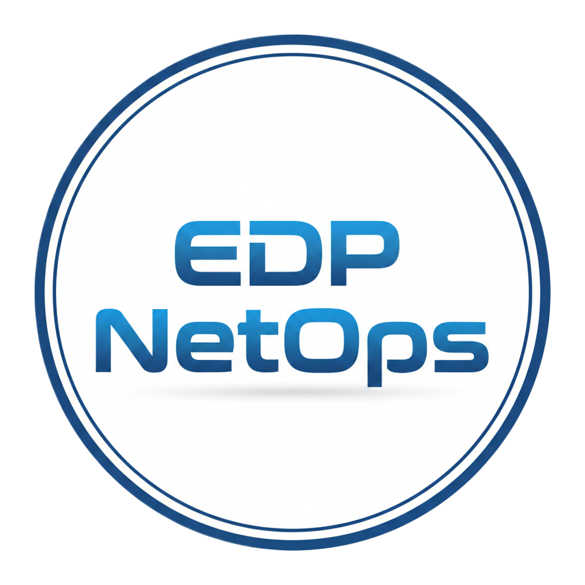

<div align="center">



# EDP NetOps

**Platform Terintegrasi untuk IT Support & Network Operations Departemen EDP**

EDP NetOps adalah platform monitoring dan manajemen operasional IT yang dirancang khusus untuk memfasilitasi kebutuhan Departemen EDP. Sistem ini membantu mengelola ratusan data jaringan toko/cabang, memantau riwayat tiket gangguan, menyediakan alat analisis data provider, serta mengotomatisasi pencatatan nomor tiket gangguan dari email provider ke database pusat.

Aplikasi ini memiliki arsitektur modular yang terbagi menjadi aplikasi klien berbasis **Flutter** (sebelumnya berfokus pada Windows Desktop, kini dioptimalkan secara aman untuk lintas platform) dan layanan background sync daemon berbasis **Node.js/TypeScript** yang bertugas menyinkronkan email provider secara otomatis.

---

[](https://flutter.dev)
[](https://dart.dev)
[](https://supabase.com)
[](https://www.typescriptlang.org/)
[](https://nodejs.org)

</div>

---

## 📌 Overview

EDP NetOps dibangun untuk mengatasi tantangan operasional jaringan pada ratusan toko cabang. Tujuan utama aplikasi ini adalah:
1. **Sentralisasi Data Jaringan Toko**: Menyimpan data IP gateway, routerboard, perangkat kasir, STB, hingga CCTV toko secara dinamis di database cloud.
2. **Efisiensi Eskalasi Gangguan**: Mengotomatisasi siklus penanganan tiket gangguan internet (ISP) melalui worker pembaca email (IMAP) yang terhubung ke database.
3. **Penyediaan Network Tools Terintegrasi**: Menyediakan alat utilitas jaringan langsung di aplikasi (multi-threaded ping scanner, FTP client, Mikrotik API) untuk mempercepat proses troubleshooting di lapangan.

---

## ✨ Key Features

### 📊 Monitoring & Manajemen Toko
* **Real-time Overview & Analytic Charts**: Ringkasan jumlah toko aktif, status online/offline, dan grafik sebaran jenis koneksi (FO, VSAT, GSM, XL).
* **Instant Search & Filter**: Pencarian toko dengan cepat berdasarkan kode toko, nama toko, tipe koneksi, maupun status konektivitas.
* **Perangkat Toko Details**: Informasi IP Address lengkap untuk router, WDCP, kasir (Station 1-5), STB, iKiosk, timbangan, dan CCTV.
* **Integrasi Remote Tools**: Membuka aplikasi eksternal (Winbox, VNC, Telnet) langsung dari aplikasi klien melalui konfigurasi path lokal.
* **Export Data Toko**: Ekspor data daftar toko ke file Microsoft Excel (`.xlsx`) secara rapi.

### 🎫 Tiket Gangguan & Sinkronisasi
* **History Ticket Management**: Pencatatan tiket gangguan manual maupun otomatis dari provider internet (Astinet, ICON, Fiberstar).
* **Automated Ticket Parsing**: Ekstraksi nomor tiket dan kode toko dari email masuk menggunakan worker berbasis IMAP secara berkala.
* **ISP Failure Ranking**: Menyajikan peringkat toko atau provider yang paling sering mengalami kendala jaringan untuk kebutuhan audit.
* **Notifikasi Email SMTP**: Mengirimkan email pembukaan/penutupan tiket eskalasi gangguan langsung dari aplikasi ke pihak provider ISP.
* **Export Laporan Lintas Lembar**: Ekspor riwayat tiket gangguan ke file Excel dengan pemisahan sheet laporan detail dan rangkuman.

### 🔌 Network Tools
* **Multi-threaded Ping Scanner**: Melakukan ping secara massal ke IP Gateway, komputer kasir, STB, WDCP, maupun CCTV di toko tujuan.
* **Scheduled Auto-Ping STB**: Pengecekan otomatis status STB toko secara berkala pada shift malam (00:00 - 03:59).
* **Mikrotik API & WDCP Manager**: Membaca registration table wireless Mikrotik, melakukan whitelist MAC address pada Access List, serta memantau utilisasi CPU dan memori routerboard.

### 🛡️ Keamanan & Administrasi
* **Role-based Access Control**: Membatasi halaman admin dan akses data sensitif berdasarkan peran pengguna (`user`, `admin`, `administrator`).
* **Audit Trail (Activity Logs)**: Mencatat setiap aktivitas penting staf (seperti login, ekspor data, ping massal) ke database cloud.
* **Dual Theme Engine**: Dukungan tema gelap (Dark Mode) dan tema terang (Light Mode) dengan penyimpanan preferensi lokal.

---

## 🧱 Project Architecture

Aplikasi klien EDP NetOps menerapkan pola **Feature-First** yang dipadukan dengan prinsip **Clean Architecture**. Pemisahan modul dilakukan berdasarkan fitur utama untuk mempermudah pemeliharaan jangka panjang.

### Struktur Folder Utama

```text
lib/
├── app/                  # Konfigurasi rute (GoRouter) dan root MaterialApp
├── layout/               # Kerangka tampilan utama, sidebar navigasi, dan base layout
├── core/                 # Shared utilities, tema, widget global, platform helper & guards
└── features/             # Direktori fitur utama aplikasi
    ├── auth/             # Logika login, registrasi, dan manajemen session user
    ├── dashboard/        # Beranda ringkasan monitoring toko dan grafik sebaran koneksi
    ├── network_tools/    # Utilitas teknis (FTP Client, Ping Scanner, Mikrotik WDCP)
    ├── profile/          # Pengaturan profil pengguna dan kontrol admin panel
    ├── settings/         # Konfigurasi SMTP email, path eksternal tools, & ganti tema
    ├── store/            # Pengelolaan data toko (CRUD data teknis jaringan toko)
    └── ticket/           # Pengelolaan log tiket gangguan, statistik, dan eskalasi email
```

* **Presentation Layer**: Terdiri dari berkas *Page*, *Widget*, dan *Controller* (menggunakan pola `ChangeNotifier` untuk manajemen state).
* **Domain & Data Layer**: Bertanggung jawab untuk mendefinisikan pemodelan data (*Model*) dan berinteraksi dengan API Supabase (`SupabaseClient`).
* **Core Layer**: Menyimpan fungsi utilitas yang bersifat global, enkripsi data lokal, ekspor file Excel, tema aplikasi, serta pemisah akses fitur per platform.

---

## 🖥️ Platform Support

Aplikasi klien dikembangkan agar dapat berjalan secara lintas platform. Namun, beberapa fitur teknis tingkat rendah yang memerlukan akses sistem operasi dibatasi melalui platform guarding (`FeatureAvailability`).

| Fitur / Modul | Windows Desktop | Android | iOS | Web |
| :--- | :---: | :---: | :---: | :---: |
| **Auth, Dashboard & Store CRUD** | ✅ Full | ✅ Full | ✅ Full | ✅ Full |
| **Ticket History & Log** | ✅ Full | ✅ Full | ✅ Full | ✅ Full |
| **Email SMTP Escalar (Mailer)** | ✅ Full | ✅ Full | ✅ Full | ❌ Limited (CORS/Web Guard) |
| **Export File (.xlsx / .csv)** | ✅ Direct System | ✅ Share/Save | ✅ Share/Save | ❌ Browser Download Only |
| **FTP Client & Mikrotik API** | ✅ Native Socket | ❌ No | ❌ No | ❌ No |
| **Ping Scanner (Multi-threaded)**| ✅ OS Process | ❌ No | ❌ No | ❌ No |
| **External Remote Launchers** | ✅ Winbox/VNC/Telnet | ❌ No | ❌ No | ❌ No |
| **Auto Update Service** | ✅ Executable Update | ✅ APK Installer | ❌ No | ❌ No |
| **Worker Control & Monitor** | ✅ Manager UI | ❌ Monitor Only | ❌ Monitor Only | ❌ Monitor Only |

> [!NOTE]
> Fitur-fitur yang bernotasi **Desktop-Only** secara aman dinonaktifkan di mobile/web menggunakan runtime check terpusat pada file `lib/core/platform/feature_availability.dart` untuk mencegah runtime crash akibat pemanggilan library native.

---

## ⚙️ Tech Stack

### Aplikasi Klien (Flutter)
* **Framework**: Flutter SDK `^3.x` / Dart SDK `^3.9.2`
* **Database & Auth**: `supabase_flutter: ^2.12.0` (Real-time DB stream, Auth, & Storage)
* **Routing & State**: `go_router: ^17.2.0` & `ChangeNotifier` / `ListenableBuilder`
* **Visualisasi & Excel**: `fl_chart: ^1.2.0` & `excel: ^4.0.6`
* **Utilitas Jaringan**: `dart_ping: ^9.0.1` & `ftpconnect: ^2.0.10`
* **Layanan Email SMTP**: `mailer: ^7.1.0`
* **UI & Integrasi OS**: `window_manager: ^0.5.1`, `desktop_drop: ^0.7.1`, `google_fonts: ^8.0.2`

### Background Sync Worker (Node.js & TypeScript)
* **Runtime**: Node.js `v20.x` & TypeScript `^5.3.3`
* **Database Client**: `@supabase/supabase-js: ^2.39.8`
* **Protokol IMAP**: `imapflow: ^1.0.155`
* **Email Parser**: `mailparser: ^3.7.1`
* **Runtime Exec**: `tsx: ^4.7.0` (Development live reloader)

---

## 🚀 Getting Started

### Prasyarat Pengembangan
Sebelum memulai pengembangan, pastikan perangkat Anda telah terpasang:
* **Flutter SDK** (Direkomendasikan versi `3.22.x` atau ke atas)
* **Node.js** (Versi `v18.x` atau `v20.x` LTS)
* **Visual Studio 2022** (dengan beban kerja *Desktop Development with C++* aktif untuk pengembangan di Windows)
* **Git**

---

### Panduan Instalasi Aplikasi Klien (Flutter)

1. **Clone Repositori**
   ```bash
   git clone <repository-url>
   cd edp_netops
   ```

2. **Ambil Dependensi Package**
   ```bash
   flutter pub get
   ```

3. **Siapkan Konfigurasi Environment**
   Salin file `.env.example` menjadi file `.env` baru pada root project:
   ```bash
   cp .env.example .env
   ```
   *Edit file `.env` tersebut dan masukkan kredensial Supabase Anda.*

4. **Jalankan Aplikasi**
   * Untuk Windows Desktop:
     ```bash
     flutter run -d windows
     ```
   * Untuk Mobile (Android / iOS):
     ```bash
     flutter run
     ```

---

## 🔐 Environment Configuration

Aplikasi memisahkan konfigurasi sensitif menggunakan file `.env` di masing-masing direktori proyek.

### Konfigurasi `.env` Klien (Flutter - Root Folder)
```env
SUPABASE_URL=https://<your-project-id>.supabase.co
SUPABASE_ANON_KEY=eyJhbGciOiJIUzI1NiIsInR5cCI...
```
*Catatan: Pada platform Desktop, file `.env` dibaca secara dinamis dari samping file executable saat dijalankan dalam mode rilis, guna meningkatkan keamanan kredensial.*

### Konfigurasi `.env` Background Worker (Folder `worker-ticket-sync/`)
```env
SUPABASE_URL=https://<your-project-id>.supabase.co
SUPABASE_SERVICE_ROLE_KEY=eyJhbGciOiJIUzI1NiIsInR5c... # Wajib untuk bypass RLS

PORT=8080
SYNC_INTERVAL_MINUTES=10

# Jam Operasional Sync Worker (Format Desimal, contoh 22.5 = 22:30)
WORKING_HOUR_START=6
WORKING_HOUR_END=22.5

# Konfigurasi IMAP Server (Dapat juga diatur via tabel app_settings di database)
IMAP_HOST=imap.gmail.com
IMAP_PORT=993
IMAP_USER=your-email@example.com
IMAP_PASS=your-app-password
IMAP_SECURE=true
```

> [!WARNING]
> Jangan pernah mengunggah atau melakukan commit file `.env` ke repositori publik. Pastikan file tersebut terdaftar di dalam `.gitignore`.

---

## 🧩 Worker Ticket Sync

Layanan background worker terletak di folder `worker-ticket-sync/` dan berjalan secara terpisah dari siklus hidup aplikasi klien Flutter.

### Menjalankan Worker di Lingkungan Pengembangan
```bash
cd worker-ticket-sync
npm install
npm run dev
```

### Menjalankan Worker di Lingkungan Produksi
Untuk server produksi (seperti VPS Linux atau server internal Windows), direkomendasikan melakukan kompilasi TypeScript terlebih dahulu:
```bash
npm run build
npm run serve
```

### Rekomendasi Menjalankan dengan PM2
Agar proses worker tetap hidup di background server:
```bash
pm2 start dist/main.js --name "netops-ticket-worker"
pm2 save
pm2 startup
```

### Catatan Penting
* Worker **tidak dibundel** ke dalam instalasi aplikasi mobile (Android/iOS).
* Worker sebaiknya dijalankan di server operasional yang aktif 24 jam atau selama jam operasional yang ditentukan (`WORKING_HOUR_START` hingga `WORKING_HOUR_END`).
* Aplikasi klien Flutter cukup memantau status keaktifan worker dan membaca data tiket yang telah di-sync langsung dari tabel database Supabase.

---

## 🧪 Testing & Analysis

Lakukan pengecekan kode program dan eksekusi pengujian secara berkala dengan perintah berikut:

* **Menganalisis Kode (Linter)**:
  ```bash
  flutter analyze
  ```
* **Menjalankan Unit Test** *(jika folder test tersedia)*:
  ```bash
  flutter test
  ```

---

## 📦 Build

### Build Aplikasi Klien (Windows Desktop)
```bash
flutter build windows --release
```
Output build rilis akan tersimpan di direktori:  
`build/windows/x64/runner/Release/`

### Build Aplikasi Klien (Android APK)
```bash
flutter build apk --release
```
Output build rilis APK akan tersimpan di direktori:  
`build/app/outputs/flutter-apk/app-release.apk`

---

## 📁 Detailed Folder Structure

Berikut adalah peta struktur direktori lengkap dari project EDP NetOps:

```text
edp_netops/
├── android/                         # Konfigurasi native platform Android
├── assets/                          # Folder aset statis (logo, gambar, dll.)
│   └── logo.png                     # Logo resmi aplikasi EDP NetOps
├── ios/                             # Konfigurasi native platform iOS
├── web/                             # Konfigurasi native platform Web
├── windows/                         # Konfigurasi native platform Windows Desktop
├── lib/                             # Kode utama aplikasi klien Flutter
│   ├── main.dart                    # Entry point inisialisasi awal aplikasi
│   ├── app/                         # Konfigurasi routing & Material App setup
│   │   ├── app.dart
│   │   └── app_router.dart
│   ├── core/                        # Modul pendukung global (Shared Core)
│   │   ├── constants/               # Variabel konstanta global
│   │   ├── env/                     # Loader aman file environment .env
│   │   ├── guards/                  # Proteksi route (AuthGuard)
│   │   ├── platform/                # Helper deteksi & guard OS spesifik (FeatureAvailability)
│   │   ├── theme/                   # Skema tema Dark & Light mode
│   │   ├── utils/                   # Helper enkripsi SHA-256 & generator Excel
│   │   └── widgets/                 # Widget global (CustomSnackBar, Loading, dll.)
│   ├── layout/                      # Template layout utama & sidebar navigasi
│   └── features/                    # Berkas fitur berbasis arsitektur modular
│       ├── auth/                    # Fitur login, logout, & data akun
│       ├── dashboard/               # Fitur statistik ringkas & list filter toko
│       ├── network_tools/           # Fitur Ping, FTP client, & kontrol Mikrotik
│       ├── profile/                 # Pengaturan user profile & user management admin
│       ├── settings/                # Pengaturan remote path apps & SMTP mailer
│       ├── store/                   # Modul pencatatan & detail perangkat toko
│       └── ticket/                  # Modul ticketing history, filter, & status sync
│
└── worker-ticket-sync/              # Project service background worker (Node.js/TypeScript)
    ├── src/                         # Kode utama TypeScript
    │   ├── main.ts                  # Inisialisasi scheduler worker
    │   ├── config.ts                # Loader konfigurasi variabel server
    │   ├── imapClient.ts            # Logika koneksi email IMAP
    │   ├── server.ts                # REST API minimal untuk cek status/healthcheck
    │   ├── supabaseClient.ts        # Client query Supabase database
    │   ├── syncTicketEmail.ts       # Logika sinkronisasi email masuk ke DB
    │   ├── ticketParser.ts          # Parser regex nomor tiket & kode toko
    │   ├── types.ts                 # Deklarasi interface TypeScript
    │   └── workerStatusService.ts   # Update detak jantung (heartbeat) worker ke DB
    ├── package.json                 # Daftar dependensi & npm scripts
    ├── tsconfig.json                # Konfigurasi kompilasi TypeScript
    └── .env.example                 # Template file konfigurasi server
```

---

## 🛡️ Security Notes

1. **Pengamanan Kredensial (.env)**: File `.env` tidak boleh dipublikasikan ke repositori git. Selalu gunakan file `.env.example` sebagai referensi struktur variabel.
2. **Supabase Row Level Security (RLS)**: Pastikan RLS diaktifkan di dashboard Supabase untuk semua tabel. Batasi hak akses CRUD berdasarkan user role yang tersimpan di tabel `profiles`.
3. **Service Role Key Limitation**: Kunci `SUPABASE_SERVICE_ROLE_KEY` hanya boleh digunakan pada file `.env` di server tempat background worker dijalankan. Jangan pernah menyematkan kunci ini ke dalam aplikasi klien Flutter.
4. **Local Credentials Encryption**: Aplikasi menyematkan enkripsi standar untuk data SMTP yang disimpan secara lokal pada perangkat pengguna guna menghindari pembacaan data penting secara ilegal.

---

## 🗺️ Roadmap

- [ ] **Stabilization Desktop & Mobile Release**: Pengujian komprehensif alur kerja pada sistem Android dan iOS.
- [ ] **Mobile-Safe Feature Gating Enhancement**: Optimalisasi pesan fallback interaktif jika fitur desktop diakses dari mobile.
- [ ] **Worker Monitoring Dashboard**: Penyediaan grafik performa sync worker langsung di halaman admin panel aplikasi klien.
- [ ] **Database Offline Sync**: Penyimpanan cache lokal terenkripsi (SQLite/Hive) saat koneksi database cloud terputus.

---

## 👨‍💻 Author

* **Pahruroji** - *Senior IT Support & Network Operations — Departemen EDP*
* GitHub: [@Pahruroji12](https://github.com/Pahruroji12)

---

## 📄 License

Project ini dikembangkan secara privat untuk kebutuhan internal **Departemen EDP**. Seluruh hak cipta dilindungi undang-undang. Pendistribusian atau publikasi ulang kode sumber ini tanpa persetujuan tertulis dari manajemen departemen dilarang keras.
